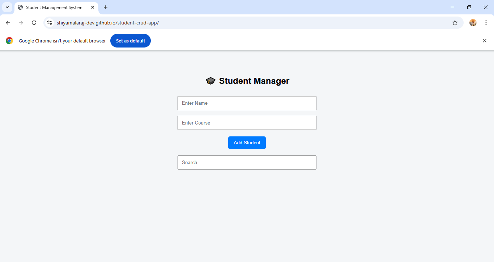
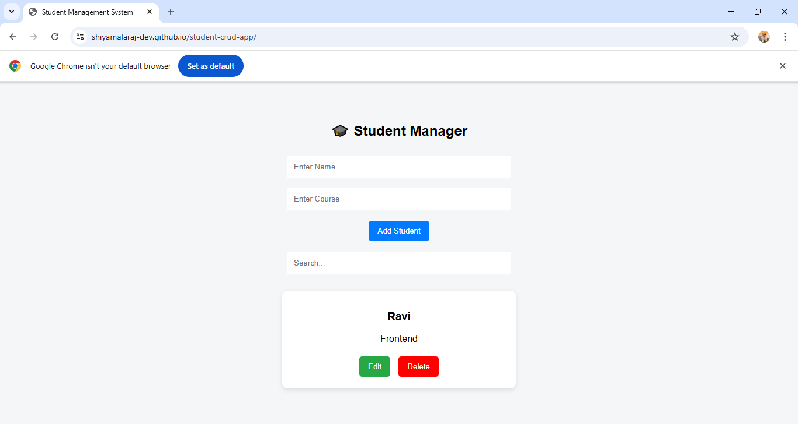
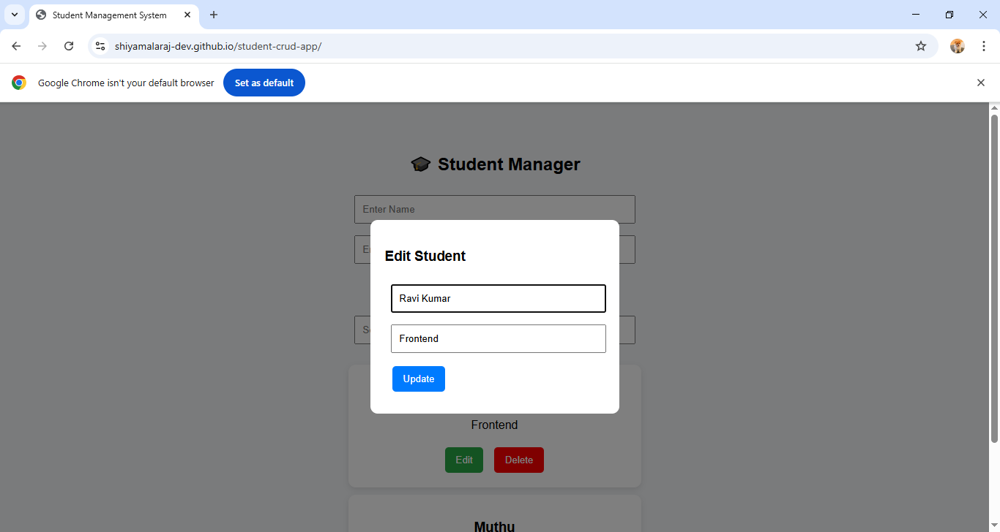
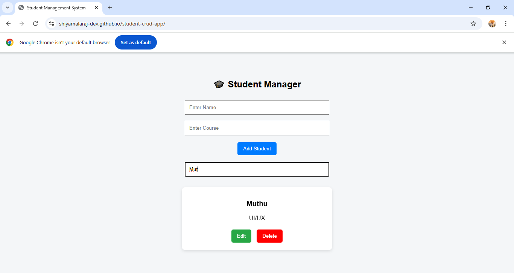
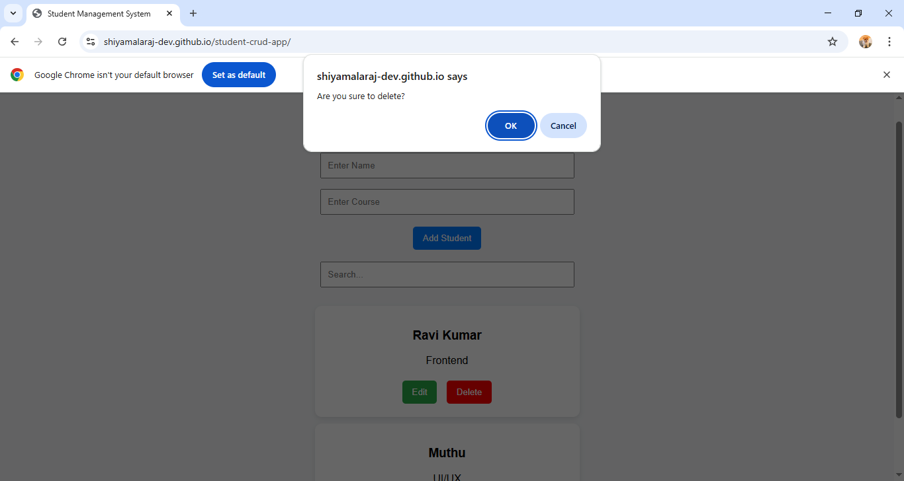

# 🎓 Student Management CRUD App

A simple and user-friendly CRUD (Create, Read, Update, Delete) web application built using HTML, CSS, and JavaScript.

---

## 🚀 Features

- ➕ Add Student
- 📋 View Student List
- ✏️ Edit Student (Popup Modal)
- ❌ Delete Student (Confirm Dialog)
- 🔍 Search Functionality
- 💾 Data stored using LocalStorage
- 🎨 Modern Card UI with Animation

---

## 🛠️ Technologies Used

- HTML
- CSS
- JavaScript

---

## 📸 Screenshots

### 🏠 Home Page

### ➕ Add Student

### ✏️ Edit Modal

### 🔍 Search Feature

### ❌ Delete Confirmation

---

## 🌐 Live Demo

👉   https://shiyamalaraj-dev.github.io/student-crud-app

---

## 📌 Author

👩‍💻 Shiyamala K  
📧 shiyamalaraj2001@gmail.com  
🔗 https://linkedin.com/in/shiyamalaraj-design
